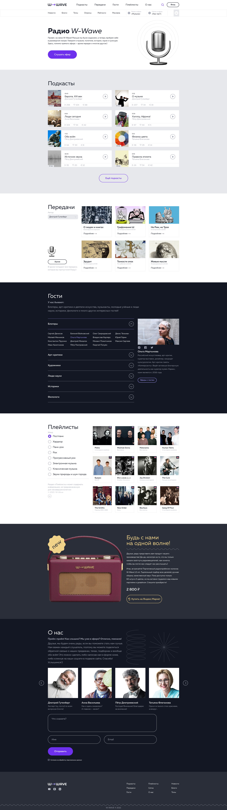

# Задача

Мы добавили в дипломный проект курса альтернативный вариант ТЗ и новый макет, чтобы разнообразить учебный процесс. Так вы укрепите своё портфолио ещё одним практическим кейсом и зарекомендуете себя в глазах будущего работодателя как хорошего специалиста

---

[Для качественного выполнения проекта постоянно проверяйте себя по чек-листу](https://docs.google.com/spreadsheets/d/1n8Vo5FohT0SEATJMDnt7sTd4_2eJxjzXoUi0w23m0os/edit#gid=0)

[Макет W-Wave Radio](<https://www.figma.com/file/uSeXndmGD8R4F8kSZxZo40/Landing_4-(W-Wave-Radio)>)
